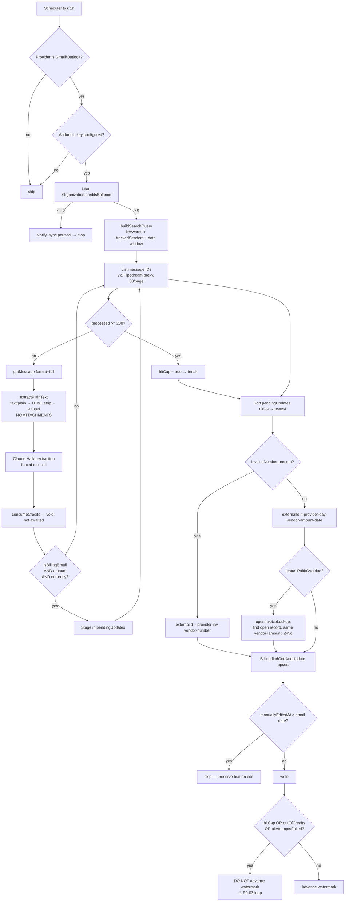
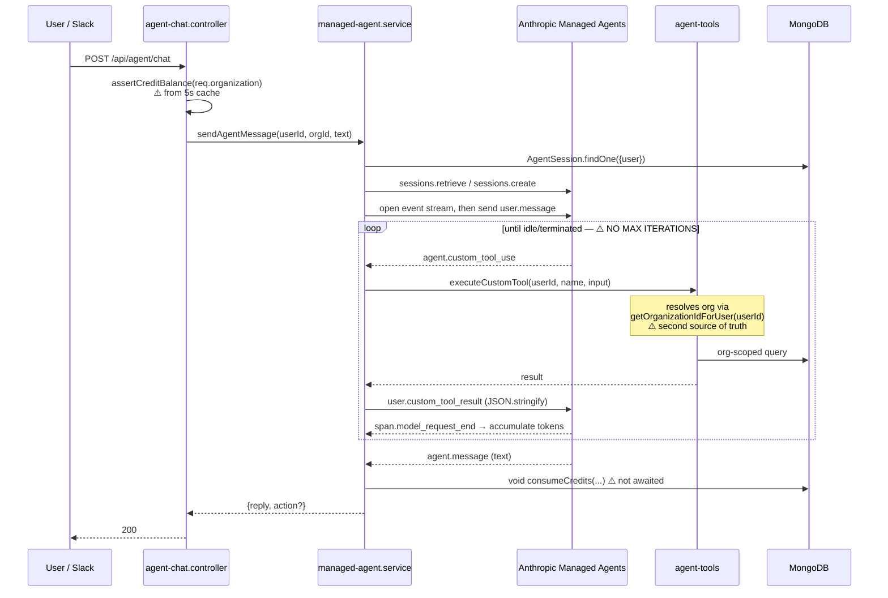
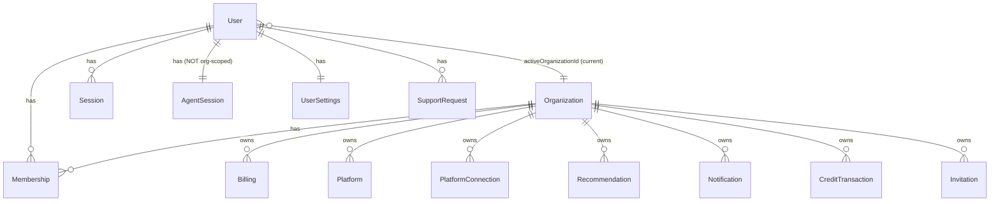
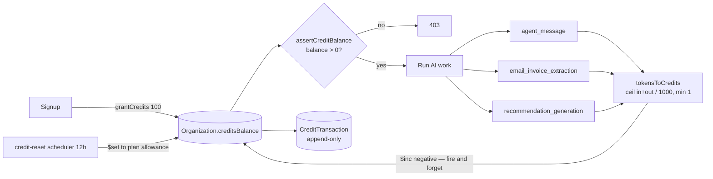

# Current Architecture (as built) + Documentation Drift

Everything below was reconstructed from code, not from docs. Nothing is drawn that isn't implemented.

---

## 1. System architecture — IMPLEMENTED NOW

```mermaid
flowchart TB
    U[User browser] --> FE[Next.js 16 / React 19<br/>Vercel]
    FE -->|Bearer JWT| API[Express 5 + TypeScript<br/>single instance]
    SL[Slack DM] -->|HMAC-signed events| API

    API --> AUTH[authenticate middleware<br/>JWT + Session + Membership<br/>5s in-memory cache]
    AUTH --> CTRL[18 controllers]
    CTRL --> MDB[(MongoDB Atlas<br/>17 collections)]

    CTRL --> AGENT[Managed Agent service]
    AGENT -->|beta.sessions| ANTH[Anthropic<br/>Claude Managed Agents]
    ANTH -->|custom_tool_use| TOOLS[6 local tools]
    TOOLS --> MDB

    subgraph SCHED[In-process setInterval schedulers]
      S1[email-sync 1h]
      S2[billing-sync 6h]
      S3[due-date 12h]
      S4[credit-reset 12h]
    end
    API -.starts at boot.-> SCHED

    S1 --> ESE[email-sync engine]
    ESE -->|Connect proxy| PD[Pipedream Connect]
    PD --> GM[Gmail API]
    PD --> MG[MS Graph]
    ESE -->|1 call per candidate email| HAIKU[Claude Haiku 4.5<br/>Messages API]
    ESE --> MDB

    S2 --> BSE[billing-sync engine<br/>129 adapters]
    BSE --> PD

    CTRL --> RESEND[Resend<br/>OTP + invites]
    S3 --> NOTIF[notification engine]
    NOTIF --> SLACKWH[Slack webhook]

    EB[[in-process event bus]] --> RECO[recommendation engine]
    RECO --> ANTH
    CTRL -.business.data.changed.-> EB
    ESE -.business.data.changed.-> EB
```

**Not implemented anywhere:** job queue, worker process, distributed lock, Redis, vector store, webhook ingestion from providers, Stripe, object storage, structured logging, metrics.

---

## 2. Invoice ingestion flow (email) — the core value path



The red flag is `AE`. Combined with the absence of any processed-message store, a mailbox exceeding 200 candidates re-runs every LLM call every hour, forever.

---

## 3. Agent request/tool flow



**Tools registered** (`agent-tools.ts`): `get_analytics_summary`, `get_platform_summary`, `search_billing_records`, `propose_update_billing_status`, `propose_delete_billing_record`, `search_supported_platforms`, `get_connection_requirements`.

All are read-only or propose-only. Writes require a user click on the existing authenticated `PUT/DELETE /api/billing/:id`. **This is the right design and should be preserved.**

**What I could not audit:** the system prompt, model selection, and tool JSON schemas live in the Anthropic Console, not the repo (`managed-agent.service.ts:3-8`). That is the most security-relevant artifact in the agent and it is unversioned. `scripts/sync-agent-config.ts` exists but the config it syncs is not checked in.

---

## 4. Multi-tenancy model



Tenancy is enforced by an `organization` field on every business collection plus `req.organization` from `authenticate`. **This is correctly applied in every controller I checked.** The weak seams are:

1. `AgentSession` is keyed by **user**, not `(user, organization)`. Mitigated by resetting on org switch — but that means org memory is destroyed on every switch, which forecloses the persistent-memory product direction.
2. Agent tools re-resolve the org from the DB rather than receiving `req.organization`. Two sources of truth for the same authorization decision (P2-12).

---

## 5. Credit metering flow



The ledger design is good — atomic `$inc`, immutable transaction rows, `balanceAfter` recorded. The problems are the check (stale cache, no reservation) and the meter (ignores cache tokens and session-hours). See P1-10.

---

## 6. Background jobs inventory

| Job | Trigger | Frequency | Idempotent? | Retry? | Lock? | Failure handling |
|---|---|---|---|---|---|---|
| `email-sync` | `setInterval` + 60s startup | 1h | Row-level yes, **LLM call no** | No | In-process `Set` only | Bare `catch {}`, silent |
| `billing-sync` | `setInterval` | 6h | Yes (upsert by externalId) | No | In-process only | Per-connection catch |
| `due-date + autoMarkOverdue` | `setInterval` + startup | 12h | Yes (signature dedup) | No | None | `logError` to console |
| `credit-reset` | `setInterval` + startup | 12h | Yes (`lastCreditResetAt`) | No | None | Swallowed |
| `recommendation refresh` | Event bus | On data change | No | No | Single-flight per **user** | Swallowed |
| `Slack event handling` | Webhook | On DM | Depends on the unique index (P0-01) | Slack retries | DB unique | Posts fallback message |

**Every one of these runs in the API process.** There is no worker, no queue, no dead-letter, no visibility. The honest assessment: this is fine for a single-instance demo and unsafe the moment you add a second replica or a customer with a real mailbox.

---

## 7. External service inventory

| Service | Purpose | Data shared | Credentials | Cost driver | Failure impact | Alternative |
|---|---|---|---|---|---|---|
| Anthropic | Agent + extraction + recommendations | Email subject/body/sender, billing aggregates | `ANTHROPIC_API_KEY` | Tokens + $0.08/session-hr | Sync stops, chat 502s | Self-hosted classifier for triage |
| Pipedream Connect | OAuth vault + API proxy for Gmail/Graph/129 adapters | OAuth scope grants; all proxied API traffic | Client id/secret/project | 1 credit / 30s compute **per proxy request** + $2/external user over 100 | All sync stops | Direct Google/Microsoft OAuth |
| MongoDB Atlas | Everything | All customer financial data | `MONGODB_URI` | Storage + IOPS | Total outage | — |
| Resend | OTP + invite email | Email addresses, OTP codes | `RESEND_API_KEY` | Per email | **Nobody can log in** | SES / Postmark |
| Slack | Alerts + DM chat | Invoice summaries, agent replies | Bot token + signing secret | Free tier | Degraded only | — |
| Vercel / Railway | Hosting | — | — | Fixed | Total outage | — |
| Stripe | — | **Not integrated** | — | — | — | — |

Single points of failure with no fallback: **Resend** (login is impossible without it) and **Pipedream** (all ingestion stops). Neither has a circuit breaker or a degraded mode.

---

## 8. Documentation drift

This is the section I'd escalate hardest. The repo contains a document marked "FROZEN / LOCKED — must not be changed" that describes an architecture which was never built.

| # | Document claim | Actual implementation | Verdict |
|---|---|---|---|
| D1 | `ARCHITECTURE.md:44` — "**LangGraph AI Agent**" with Planner → Memory → Tool Calling → Reasoning → Response Generator | Anthropic **Claude Managed Agents**. No LangGraph dependency exists in any `package.json`. No planner, no memory module. | **Doc must change.** Code is right. |
| D2 | `ARCHITECTURE.md:46` — "**Qwen 3 Instruct** (AI Brain)" | `claude-haiku-4-5-20251001` for extraction; a Console-configured Claude model for the agent. | **Doc must change.** |
| D3 | `DECISIONS.md` D-001 — flow is "🔒 Locked… Any change requires a new decision entry here." | The flow changed completely. **No decision entry was ever added.** | The decision log is untrustworthy. Rewrite or delete it. |
| D4 | `ARCHITECTURE.md` — Analytics Engine includes "**Forecast Engine**", "**Cost Optimizer**", "Usage Analyzer" | `analytics.engine.ts` + `advanced-analytics.ts` do totals, status splits, monthly trend, recurring detection, duplicate detection. **No forecasting. No optimizer.** | Doc overstates. |
| D5 | `ARCHITECTURE.md:88` — Backend deploys to **Render** | Code comments reference **Railway** (`auth-cache.ts:12`). | Doc stale. |
| D6 | `README.md:3` — "A **production-ready** AI-powered SaaS platform" | Zero tests, zero CI, no payments, production indexes never built. | **Remove this claim.** It is the kind of thing a diligence process quotes back at you. |
| D7 | `PRODUCTION-HARDENING.md` — "Rate limiting on `POST /api/auth/register` and `/api/auth/login`" | Those endpoints no longer exist (auth went passwordless). The OTP endpoints that replaced them have **no rate limiting**. | Doc stale **and** the underlying gap is unfixed and now more severe. |
| D8 | `PRODUCTION-HARDENING.md` — "dummy `bcrypt.compare` on the user-not-found path" | No bcrypt, no passwords. But enumeration is now **explicit** — a 404 with "No account found with this email." | Doc stale; real issue worse. |
| D9 | `PRODUCTION-HARDENING.md` — "`User.syncIndexes()` on startup… uniqueness enforcement depends on that index existing" | **Still not done.** This is P0-01. | The team already knew. It was deferred and forgotten. |
| D10 | `PRODUCTION-HARDENING.md` — "Automated test suite committed to the repo" | Zero test files in the repository. | Still owed. |
| D11 | `CLAUDE.md:9` — points future agents to `ARCHITECTURE.md` as the "locked/frozen target architecture blueprint" | That blueprint is wrong. | **Highest-priority doc fix.** Any AI agent reading `CLAUDE.md` will be routed to a document describing LangGraph + Qwen. |

### Why this matters more than usual

`CLAUDE.md` is explicitly an instruction file for AI coding agents. It directs them to a frozen architecture doc describing a stack that doesn't exist. The next agent session that tries to "restore the locked architecture" will attempt to introduce LangGraph and Qwen into a Claude-based codebase.

**Recommended action, before any other work:**
1. Delete `docs/ARCHITECTURE.md` and replace it with the diagrams in this file, marked *"describes the system as of commit `e3ad6ad` — update with the code."*
2. Add `DECISIONS.md` entry D-004: *"D-001 superseded. LangGraph and Qwen were never implemented. The system uses Claude Managed Agents for chat and Claude Haiku 4.5 for extraction."*
3. Strike "production-ready" from `README.md`.
4. Rewrite `PRODUCTION-HARDENING.md` against the current passwordless auth flow.

Documentation drift is normally a P3. Here it is a **P1**, because the docs are an input to an automated code-generation process.
