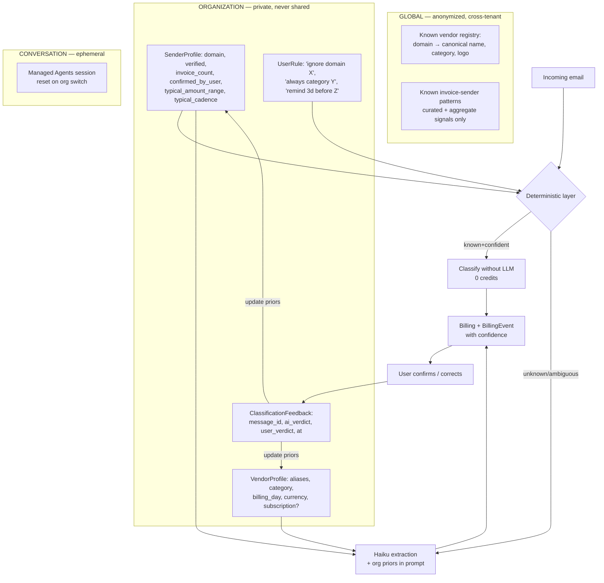
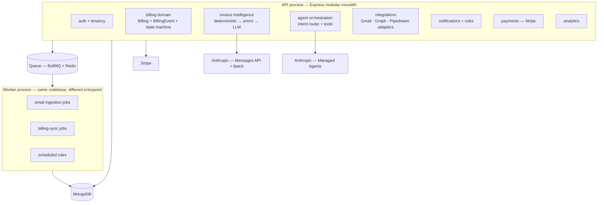

# Launch Readiness, Roadmap & Target Architecture

---

## 1. Launch blocker checklist

### Must fix before internal testing
| Issue | Why it blocks | Effort |
|---|---|---|
| P0-01 Indexes never built in production | Dedup, uniqueness, and Slack event idempotency are all fictional in prod | 0.5d |
| P2-15 `npm ci` fails on frontend | Vercel uses `npm ci`; the deploy is broken today | 15min |
| P2-06 Silent `catch {}` in sync engine | You cannot debug anything you cannot see | 1d |
| D11 `CLAUDE.md` → frozen LangGraph/Qwen doc | The next AI session will build the wrong thing | 1h |

### Must fix before private beta
| Issue | Why it blocks | Effort |
|---|---|---|
| P0-02 Predictable OTPs + no rate limit + non-atomic attempts | Account takeover on a financial dataset | 1d |
| P0-03 Sync loop re-bills the same 200 emails | Customer's data never completes; credits die in hours | 2d |
| P1-03 No provenance | Beta users cannot verify anything, so feedback is worthless | 1w |
| P1-02 Vendor model inverted | The primary demo query fails | 1w |
| P1-09 Mixed-currency sums on dashboard | One wrong number destroys trust permanently | 0.5d |
| P2-02 No TTL on Session/Otp | Unbounded growth from day one | 2h |

### Must fix before accepting payments
| Issue | Why it blocks | Effort |
|---|---|---|
| **No Stripe at all** | There is no way to take money | 2–3w |
| `PUT /api/plan` self-upgrade is free | Anyone can grant themselves Business | included above |
| Credit cycle is 365 days for paid tiers | Customers pay monthly and get AI annually | 1d |
| No credit purchase / top-up flow | Running out means churn | included above |
| No immutable webhook-event ledger | Duplicate Stripe events would double-grant credits | included above |

### Must fix before public launch
| Issue | Why it blocks | Effort |
|---|---|---|
| P1-01 Prompt injection + no sender verification | You would be laundering fraudulent invoices into trusted datasets | 1w |
| P1-05 No PDF/attachment parsing | Recall gap is visible on day one | 1w |
| P1-06 Outlook ordering assumption | Silent mail loss | 3d |
| P2-04/P2-05 Sequential sync + in-process schedulers | Breaks at ~50 customers or on any second replica | 2w |
| Zero tests, zero CI | No regression safety on financial data | 2w |
| P1-07 Key rotation impossible | You will need to rotate eventually | 3d |
| Data retention / deletion policy | GDPR-style obligations start with customer #1 | 1w |

### Can wait until growth
Compound index tuning, job queue, analytics caching, i18n consistency, `morgan`/`qs` advisories, dead-code cleanup, accessibility pass.

---

## 2. 30 / 60 / 90 day roadmap

Grounded in findings, not in the template. The sequencing rule: **make it correct → make it verifiable → make it sellable → make it scale.**

### Days 1–30 — Stop the bleeding

**Goal:** the app is safe to run and its data is trustworthy.

1. Index migration + `syncIndexes()` at boot; verify against live Atlas *(P0-01)*
2. `crypto.randomInt` for OTP; atomic `$inc` for attempts; rate limits on all auth routes; `app.set('trust proxy', 1)` *(P0-02)*
3. `ProcessedEmailMessage` collection; let the watermark advance on cap *(P0-03)*
4. Fix `npm ci`; add GitHub Actions running typecheck + lint + build on every PR *(P2-15)*
5. Replace `catch {}` with structured logging + `lastSyncError`/`lastSyncAt` on `PlatformConnection`, surfaced in the UI *(P2-06)*
6. Remove mixed-currency `totalRevenue`; return per-currency breakdowns *(P1-09)*
7. TTL indexes on `Session` and `Otp` *(P2-02)*
8. Rewrite `ARCHITECTURE.md`, add `DECISIONS.md` D-004, strike "production-ready" from `README.md` *(D1–D11)*
9. First test suite: Vitest + `mongodb-memory-server` + supertest, covering auth, tenancy isolation, and the sync dedup path

**Exit criterion:** a large mailbox syncs to completion without exhausting credits, and you can prove tenant isolation with a test rather than an argument.

### Days 31–60 — Make it trustworthy and sellable

**Goal:** a user can verify every number, and you can charge for it.

10. **Provenance migration** — add source/evidence/confidence fields; backfill what's recoverable *(P1-03)*
11. **Vendor model** — real `Vendor` collection, `vendorDomain`, rename the inverted fields, add vendor search to the agent tool *(P1-02)*
12. **`BillingEvent` append-only log + state machine** — status becomes a derived projection over immutable evidence *(P1-04)*
13. **Trust UX** — confidence badges, "AI classified / you verified / rule applied", source-email link, possible-duplicate flags, last-sync status
14. **Prompt-injection defense** — system prompt with explicit data framing, delimiters, DMARC/SPF/DKIM capture, output sanitization before agent context *(P1-01)*
15. **Stripe**, minimum production-grade: Checkout → Customer → Subscription → webhook with raw-body signature verification → immutable `StripeEvent` ledger keyed on `event.id` (this is what prevents double credit grants) → plan sync from webhook only, never from the frontend. Cover `checkout.session.completed`, `customer.subscription.created/updated/deleted`, `invoice.paid`, `invoice.payment_failed`. Build a test-mode scenario matrix before going live.
16. Monthly credit cycles for all tiers; reserve-then-reconcile ledger; credit top-up purchase
17. Route deterministic queries away from the LLM — intent classifier + analytics functions

**Exit criterion:** you can take a customer's money, and when they ask "why is this Paid?" the product shows them the email.

### Days 61–90 — Make it scale and make it smart

18. PDF/attachment extraction *(P1-05)*
19. Direct Gmail + Microsoft Graph OAuth, with `history.list` / delta queries *(P1-06, Pipedream cost)*
20. Move schedulers out of the API process: queue + worker + distributed lock *(P2-04, P2-05)*
21. **The learning loop** — this is the actual differentiator, and it only becomes possible once #10–12 land
22. Prompt caching + Batch API on extraction; conversation summarization; `MAX_ITERATIONS`
23. Compound indexes; pagination on list endpoints; analytics result caching
24. Observability: structured logs, error tracking, sync-success and extraction-accuracy dashboards
25. Data retention policy, export, and deletion

---

## 3. The learning architecture (what "the agent learns your business" should mean)

The brief asked me to design this if the current one is insufficient. It is insufficient — there is effectively no learning. Here is the minimum design that earns the claim.

**Three separated tiers. Do not blur them.**

**How a correction actually changes behaviour:**

1. User marks a record "not an invoice."
2. Write a `ClassificationFeedback` row with the sender domain, subject shape, and message id.
3. A nightly job updates that org's `SenderProfile`: `false_positive_count++`.
4. Once `false_positive_count ≥ 3` and `confirmed_invoice_count = 0`, the deterministic layer suppresses that domain for this org — and tells the user it did.
5. Conversely, three user-confirmed invoices from a sender promote it to a trusted prior, which is injected into the extraction prompt as context and raises the confidence floor.

**What belongs where:**

| Data | Storage | Why |
|---|---|---|
| Vendor/sender profiles, rules, feedback | **MongoDB** | Structured, queried deterministically, must be exact |
| Invoice records + events | **MongoDB** | Source of truth, needs transactions and indexes |
| Conversation context | **Managed Agents session** | Ephemeral by design |
| Aggregate analytics | **MongoDB aggregation, cached** | Must be exact; never an LLM's job |
| Semantic invoice search | **Deferred** | Only if users actually ask fuzzy questions the tools can't answer |

**On vector databases:** don't. The brief was right to be suspicious. Your retrieval problems are `{organization, vendorDomain, dateRange}` — that is a b-tree query, not a similarity search. A vector store would add cost, an embedding pipeline, and a staleness problem while solving nothing. Revisit only if you ship semantic search over invoice *text* and measurably cannot serve it from Mongo.

**What must never enter an LLM prompt:** OAuth tokens, API keys, `organizationId` as a trust signal, raw unsanitized email HTML, other tenants' data in any form, and the agent's own authorization boundary. Authorization is decided in code before the tool runs, never negotiated in the prompt.

**Fine-tuning:** not needed. Your accuracy gap is a *context* problem (no vendor priors, no attachments, no provenance), not a model-capability problem. Fix the pipeline first; you will find the remaining error rate doesn't justify the operational cost of a fine-tune.

---

## 4. Target architecture (12–24 months)

**Stay a modular monolith.** The brief's instinct is right and the code supports it — nothing here justifies microservices. What matters is keeping the module boundaries clean enough that any one could be extracted later if load genuinely demands it.

| Component | Verdict | Reasoning |
|---|---|---|
| Express + TypeScript + Mongoose | **KEEP** | Fits the domain; no reason to move |
| MongoDB | **KEEP** | Document shape suits invoices and events well |
| Controllers talking directly to Mongoose | **IMPROVE, selectively** | Fine for `Platform` and `Notification` CRUD. Extract a service layer only for the billing domain, where the state machine and evidence rules actually need one. Don't layer for purity. |
| `Billing` model | **REPLACE** | `Billing` (projection) + `BillingEvent` (append-only truth) |
| Email sync engine | **REFACTOR** | Layered pipeline with a processed-message store and a deterministic pre-filter |
| Managed Agents | **KEEP, narrow** | Reasoning only; deterministic queries routed elsewhere |
| Pipedream | **KEEP for 129 adapters, REPLACE for email** | Cost and sync-primitive reasons, not aesthetics |
| In-process schedulers | **REPLACE at ~50 customers** | BullMQ + Redis. ~$10–20/mo. Justified by P2-04/P2-05, not before. |
| Vector DB | **DEFER indefinitely** | Solves no current problem |
| Microservices | **DEFER indefinitely** | No boundary is under independent load pressure |

**Cost of each addition:** Redis + BullMQ ≈ $15/mo + ~1 week of engineering, needed at ~50 active customers. Error tracking ≈ $0–26/mo, needed immediately. Everything else in the target is a refactor of existing code, not new infrastructure.

---

## 5. The next 10 engineering tasks, in exact order

### 1. Build indexes in production
- **Objective:** every declared index exists in the live cluster.
- **Reason:** P0-01. Several safety mechanisms are currently fictional.
- **Files:** `config/database.ts`, new `scripts/sync-indexes.ts`, deploy config.
- **Dependencies:** none. **Risk:** low — building a unique index fails loudly if duplicates already exist, which is itself information you need.
- **Acceptance:** `db.<collection>.getIndexes()` on production matches every schema declaration; a duplicate-key write is rejected.
- **Tests:** integration test asserting duplicate `User.email` and duplicate `(org, connection, externalId)` both throw.

### 2. Harden the OTP flow
- **Objective:** auth codes are unpredictable and the attempt limit is unbypassable.
- **Reason:** P0-02. This is the entire credential in a passwordless app.
- **Files:** `auth.controller.ts:67,104`, `routes/auth.routes.ts`, `app.ts`.
- **Dependencies:** task 1 (the OTP unique index must exist). **Risk:** low.
- **Acceptance:** codes from `crypto.randomInt`; 100 concurrent wrong guesses consume exactly 5 attempts; 6th request returns 429; `req.ip` is the client IP behind the proxy.
- **Tests:** concurrency test on the attempt counter; rate-limit test; statistical check that codes aren't from a seeded PRNG.

### 3. Processed-message store + watermark advance
- **Objective:** no email is ever sent to the LLM twice.
- **Reason:** P0-03 and the 24× cost multiplier. Also the only way backfill completes.
- **Files:** new `models/processed-email-message.model.ts`, `services/email-sync/sync-engine.ts`.
- **Dependencies:** task 1. **Risk:** medium — get the TTL right or you lose idempotency on long-tail messages. Suggest 180 days.
- **Acceptance:** a 5,000-message mailbox completes backfill across runs; a second run over the same window issues zero Anthropic calls; credits consumed match unique messages processed.
- **Tests:** integration test with a stubbed provider returning 500 messages across 3 runs, asserting exactly 500 extraction calls total.

### 4. CI pipeline + first tests
- **Objective:** typecheck, lint, build, and test run on every PR.
- **Reason:** zero regression safety on a financial dataset; the lockfile is already broken.
- **Files:** `.github/workflows/ci.yml`, `frontend/package-lock.json`, `backend/vitest.config.ts`.
- **Dependencies:** none. **Risk:** none.
- **Acceptance:** `npm ci` succeeds in both packages; CI red on a deliberately introduced type error.
- **Tests:** the suite from tasks 1–3 is the initial content.

### 5. Sync observability
- **Objective:** every sync run's outcome is visible to both operator and customer.
- **Reason:** P2-06. You currently cannot tell a broken integration from an empty inbox.
- **Files:** `sync-engine.ts`, `platform-connection.model.ts`, `connections-panel.tsx`.
- **Dependencies:** none. **Risk:** low.
- **Acceptance:** `lastSyncAt`, `lastSyncStatus`, `lastSyncError`, `messagesScanned`, `invoicesFound` persisted and rendered; a revoked OAuth token surfaces a "Reconnect" CTA.
- **Tests:** provider-failure test asserting the error is persisted, not swallowed.

### 6. Provenance schema + backfill
- **Objective:** every record carries its source, evidence, and confidence.
- **Reason:** P1-03. Unlocks trust UX, dedup, the state machine, and learning at once.
- **Files:** `billing.model.ts`, `sync-engine.ts`, `ai-invoice-extractor.ts`, `billing.serializer.ts`, new migration.
- **Dependencies:** task 1. **Risk:** medium — a migration over live data; run additive-only, backfill lazily.
- **Acceptance:** every new record has `sourceMessageId`, `senderEmail`, `senderDomain`, `extractionConfidence`, `evidence[]`; the API exposes them; `GET /api/billing/:id` can render a source trail.
- **Tests:** round-trip test from stubbed email → record with correct provenance.

### 7. Vendor domain model
- **Objective:** "Show invoices from AWS" works.
- **Reason:** P1-02. It is the primary demo query and it currently fails silently.
- **Files:** new `models/vendor.model.ts`, `billing.model.ts`, `billing-search.tool.ts`, `sync-engine.ts`, migration.
- **Dependencies:** task 6. **Risk:** medium — field rename across the stack.
- **Acceptance:** agent search accepts `vendor` and `vendorDomain`; the query returns AWS records; dashboard groups by vendor, not connection.
- **Tests:** agent-tool test asserting vendor search returns the right rows; migration test on legacy records.

### 8. BillingEvent log + status state machine
- **Objective:** status is derived from immutable evidence, not overwritten.
- **Reason:** P1-04. Handles out-of-order email, conflicting evidence, and manual override.
- **Files:** new `models/billing-event.model.ts`, new `services/billing/status-machine.ts`, `sync-engine.ts`.
- **Dependencies:** tasks 6, 7. **Risk:** high — this is the core domain change. Ship behind a flag, dual-write, compare, then cut over.
- **Acceptance:** invoice → reminder → receipt collapses to one obligation with three events; a stale reminder arriving after a receipt does **not** flip it back to Pending; manual override always wins and is recorded as an event.
- **Tests:** a state-machine table test covering out-of-order, duplicate, conflicting, and manually-overridden sequences.

### 9. Prompt-injection defense + sender verification
- **Objective:** email content cannot influence agent behaviour, and spoofed senders are flagged.
- **Reason:** P1-01. Without this you normalize fraudulent invoices into a "trusted" dataset.
- **Files:** `ai-invoice-extractor.ts`, `agent-tools.ts`, `managed-agent.service.ts`, providers.
- **Dependencies:** task 6. **Risk:** medium.
- **Acceptance:** an email containing "ignore previous instructions" produces normal extraction; extracted vendor names are sanitized before entering agent context; DMARC/SPF/DKIM results are captured and a failure downgrades confidence and surfaces a warning.
- **Tests:** an adversarial corpus of ~30 injection attempts (direct, encoded, in-vendor-name, in-invoice-number) asserting no behavioural change.

### 10. Stripe, minimum production-grade
- **Objective:** you can take money and credits can't be double-granted.
- **Reason:** there is no revenue path.
- **Files:** new `services/payments/*`, `controllers/stripe-webhook.controller.ts`, `models/stripe-event.model.ts`, `plan.controller.ts`.
- **Dependencies:** tasks 1, 4. **Risk:** high — real money.
- **Acceptance:** raw-body signature verification; every `event.id` recorded in a unique-indexed ledger before processing; replaying a webhook grants credits exactly once; out-of-order `subscription.updated` resolved by comparing `created`; plan tier writable **only** by the webhook handler, never by the client; `PUT /api/plan` restricted to downgrade-to-Free or removed.
- **Tests:** a test-mode scenario matrix — new subscription, upgrade, downgrade with proration, cancel-at-period-end, immediate cancel, payment failure + retry, duplicate webhook, out-of-order webhook, refund.

---

## 6. Founder's closing read

You have built roughly 70% of a good SaaS chassis and roughly 20% of the product in the brief. The chassis is genuinely better than most first attempts — the tenancy discipline, the propose-then-confirm agent pattern, and the incident-driven comments are signals of someone who is actually paying attention. That is the hard part to teach.

What's missing is not more features. It's that the invoice domain model is too thin to represent the thing you're selling. Everything the vision asks for — confidence, evidence, lifecycle, learning, "why is this Paid?" — is downstream of a schema that currently stores an amount, a name, and one of three statuses. You cannot prompt your way out of a missing data model.

**What to stop building:** more Pipedream adapters (129 is already more than any customer will use), more agent surface area, more UI polish.

**What to build next:** provenance, the vendor model, and the event log. In that order. They are the foundation for every differentiated claim you want to make, and none of the interesting product work is possible until they exist.

The most encouraging thing I can tell you: none of the P0s are architectural. They're four bugs and a missing migration. The expensive work is the domain model — and that's a rewrite of one collection, not the system.
