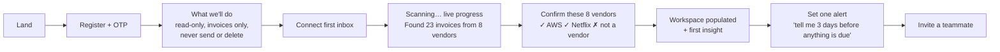

# Frontend, Product UX & Domain Correctness

Continues the audit into the areas flagged as uncovered: the frontend, the 129 billing-sync adapters, and the product experience.

---

## Part A — The 129 adapters are not invoices

This is the most significant finding in this second pass, and it changes how you should read every number the product displays.

I read the adapter layer and ran a census across all 129 files:

| Measurement | Result |
|---|---|
| Total adapters | **129** |
| Hardcode `status: "Pending"` | **124** |
| Derive real status from the provider | **5** (`gocardless`, `heroku`, `mongodb`, `northflank`, `snapchat-marketing`) |
| Use `billingDate: now` — the *sync* timestamp, not a billing date | **122** |
| Model usage / balance / quota rather than an invoice | **101** |
| Admit in comments that the API shape is unverified | **7** |

Representative example (`adapters/openai.adapter.ts`):

```js
externalId: `openai-${period}`,      // one row per MONTH, mutated in place
amount: total,                        // month-to-date sum of cost buckets
billingDate: now,                     // ← the time the sync ran
status: "Pending",                    // ← always, forever
```

**What this actually is:** a month-to-date usage accrual that gets overwritten on every 6-hour sync, dated at sync time, permanently marked Pending. It is not an invoice, has no due date, no invoice number, and never resolves.

### Four consequences

**1. "Outstanding" is structurally meaningless.** Every auto_sync record is `Pending` and never becomes `Paid`. `autoMarkOverdue` skips them (no `dueDate`). So the dashboard's pending count and outstanding total accumulate accrual rows indefinitely and never clear. A user with 10 connected platforms has 10 permanently-pending "invoices" that are actually just running usage meters.

**2. Monthly trend is misdated.** `analytics.engine.ts` groups by `billingDate`. With `billingDate = now`, all auto_sync spend lands on whichever day the sync happened to run — not when it was billed. Within a month the record's date keeps moving forward as it re-syncs. "How much did we spend in July?" is wrong for every auto_sync platform.

**3. Double counting.** A customer who connects OpenAI via billing-sync *and* receives OpenAI invoices in Gmail gets both: the accrual and the real invoice. Different `platformConnection`, so the unique index cannot catch it. Their OpenAI spend displays at roughly 2×. This is exactly the scenario the product is built for, so it is not an edge case.

**4. Two incompatible record types in one collection.** `Billing` now holds real invoices (manual, email-derived, and 5 adapters) alongside mutable usage accruals, sharing one status vocabulary and one date field. Every aggregation mixes them.

### Recommendation

Do not fix this by patching adapters. Separate the concepts:

- **`Billing`** — discrete, immutable financial obligations with a real issue date, amount, and lifecycle.
- **`UsageAccrual`** — current-period metered spend, explicitly labelled "month to date", excluded from outstanding/overdue, shown in its own dashboard section.

Then relabel the feature honestly. "129 platform integrations" is a real and impressive engineering artifact, but what it delivers today is *live usage tracking for 124 platforms and invoice sync for 5*. Marketing it as invoice coverage will not survive a customer reconciling against their credit card statement.

**Effort:** 1 week (new model + migration + analytics split + UI section). **Priority:** P1 — it silently corrupts every number on the dashboard.

---

## Part B — Frontend audit

### What's good

- Clean Next.js 16 / React 19 / Tailwind 4 / shadcn app. Consistent component structure, sensible file organisation, shared `PageWrapper` / `EmptyState` / `ErrorState` / `LoadingSpinner` primitives actually used rather than declared.
- **No XSS vectors found.** `grep` for `dangerouslySetInnerHTML`, `rehype-raw`, `skipHtml` → zero matches. Agent replies render through `react-markdown` with default escaping. This matters a lot given email content reaches the agent.
- `services/api/client.ts` is a genuinely good single fetch layer — typed, centralised 401 handling, never leaks stack traces to the UI, and forbids components attaching tokens themselves.
- `session-storage.ts` is defensive: validates shape, checks `exp` client-side, clears on any corruption.
- Loading, error, and empty states exist on every major view. Charts degrade to a per-card "No history yet" rather than blanking the page.

### P1-11 — The Billing page search cannot find vendors

| **File** | `frontend/src/components/billing/billing-view.tsx:110-121`, `backend/src/utils/billing.serializer.ts:44` |
|---|---|

The table's vendor column renders `platform.name`, which the serializer populates from `billing.vendorName` — so the user sees **"Netflix"**.

The search box filters on:

```js
record.customerName.toLowerCase().includes(query) ||
record.invoiceNumber.toLowerCase().includes(query)
```

`customerName` for email-derived records is **the user's own organization name**. So a user looks at a row labelled "Netflix", types "Netflix" into the search box, and gets zero results.

Worse, `toPublicBilling` doesn't expose `vendorName` as its own field at all — it's folded into `platform.name`. The frontend cannot fix this without a backend change.

This is the same root cause as P1-02 (the agent's vendor search), surfacing in a second place. It is also the most immediately demo-breaking bug in the product: it's the first thing anyone tries.

### P2-18 — The entire billing list is loaded client-side

`billing-view.tsx:69` — *"Search / filter / pagination state (all client-side over the loaded list)"*. `listBillingRecords()` calls `GET /billing` with no parameters; the backend returns every record with two `populate()` calls and no limit (P1-08).

At 10k records that's a multi-MB payload parsed and filtered in the browser on every visit. `PAGE_SIZE = 10` is purely cosmetic — the client already holds everything.

**Fix:** move search, status filter, sort, and pagination to the server. Add `?page&limit&q&status&vendor&from&to`. This is a paired frontend/backend change and should ship with P1-08.

### P2-19 — Information architecture buries the core action

Sidebar: Dashboard · Integrations · Billing · Analytics · Billing Agent · Settings.

**There is no "Email accounts" destination.** Connecting Gmail or Outlook — the single action that makes this product work — lives in Settings → Email Sync, a sub-tab of a sub-page. A new user has no path to first value from the dashboard.

Also: "Billing" in the sidebar means *invoices you receive*, while "Billing" in Settings → Billing & Plan means *your subscription to this app*. Two different meanings, one word, in one navigation tree.

**Fix:** promote email connection to a first-class nav item (e.g. "Inboxes"). Rename the settings tab to "Subscription".

### P2-20 — No onboarding, no first-run guidance

`grep` for onboarding/first-run/getting-started copy → nothing. A newly registered user lands on an empty dashboard with three empty charts and a greeting. There is no:

- guided "connect your first inbox" step
- explanation of what the product will read from their mailbox
- privacy statement at the OAuth consent moment (the only privacy copy in the app is inside the tracked-senders dialog, which most users will never open)
- sync progress indicator — `metadata.emailSync.lastSyncedAt` is read in `platforms-view.tsx:65` but there is no "scanning… 340 of 1,200 messages" state
- verification step where the user confirms the first batch of detected invoices

For a product asking businesses to grant mailbox access, **explaining what you read before asking is not optional** — it's the difference between a 20% and a 60% connect rate, and it's a compliance posture as much as a UX one.

### P2-21 — No trust UX

The brief asked specifically how to communicate source, confidence, and freshness. Today the UI communicates **none** of it, because (per P1-03) the data doesn't exist. The Billing table shows: platform, customer, invoice number, amount, currency, date, status, source badge. That's it.

A user cannot tell whether a row is something they typed, something an AI guessed from an email, or a usage accrual that isn't an invoice at all. In financial software that ambiguity is the whole ballgame.

**Once provenance lands (P1-03), the minimum trust surface is:**

| Signal | Treatment |
|---|---|
| Origin | Badge: `You added` · `From email` · `Synced from OpenAI` |
| Confidence | Only surface when low: "Amount unclear — please confirm" |
| Evidence | "View source email" link on every AI-derived row |
| Status basis | "Marked Paid from a receipt on 12 Sep" vs "Assumed pending" |
| Freshness | "Gmail synced 4 minutes ago" · "Outlook hasn't synced in 3 days" |
| Duplicates | "Possible duplicate of INV-1042" with a merge action |
| Manual override | "Edited by Sara, 3 Sep" — never silently overwritten |

### P2-22 — Dashboard answers the wrong question

The overview is chart-first: spend trend, platform spend, invoice status. It answers *"how much did I spend?"* It does not answer *"what do I need to do?"*

Missing, in rough priority order: what's due this week · what's overdue · what changed vs last month · which integrations are unhealthy · what needs my confirmation · where can I save money.

Also `primaryTotals = analytics.totalsByCurrency[0]` — the headline number is the largest currency only, with no indication that other currencies exist or are excluded. A business with USD and EUR invoices sees a confidently-displayed number that is quietly incomplete.

**Recommended hierarchy:**
1. **Needs attention** — overdue, due ≤7 days, failed syncs, low-confidence records awaiting confirmation
2. **This month** — spend to date vs last month, per currency, with the delta
3. **Recurring** — active subscriptions, renewals in the next 30 days, price changes detected
4. **Opportunities** — recommendations with a concrete dollar figure
5. **Health** — per-integration last-sync status

### P3 frontend items

| ID | Finding | File |
|---|---|---|
| P3-01 | JWT in `localStorage` — standard, acceptable given no XSS vectors were found, but it means any future XSS is full account compromise. A CSP header would materially reduce that blast radius; `helmet()` is used with defaults, so no CSP is set. | `session-storage.ts`, `app.ts:19` |
| P3-02 | Markdown `a` renders agent-supplied `href`s. `react-markdown` v10 strips dangerous protocols by default, so not exploitable — but since email-derived vendor names reach the agent, a phishing link could be echoed into a reply. Worth an allowlist. | `markdown-message.tsx:23` |
| P3-03 | `analytics-view.tsx` is 858 lines — by far the largest component. Candidate for decomposition. | — |
| P3-04 | `page-data-cache` is an in-memory cache with no invalidation on mutation, so a stale overview can render after an edit. | `lib/page-data-cache.ts` |
| P3-05 | No accessibility pass evident: no skip links, no visible focus-management on dialogs beyond shadcn defaults, charts have no text alternative. | — |
| P3-06 | `GET /api/invitations/:token` is unauthenticated with no rate limit — a token-enumeration surface. Token entropy should be verified and the route throttled. | `invitation.routes.ts:9` |

---

## Part C — Proposed customer journey

The current journey is: register → OTP → empty dashboard → *(nothing)*.

What it should be:



Step **F** is the important one and it does not exist today. It simultaneously:
- delivers the "wow" moment (the product found things you forgot about)
- gets the user to verify the data, which is what makes them trust it
- generates the first training signal for the learning loop
- surfaces false positives immediately instead of letting them rot in the table

It is also cheap to build once provenance exists — it's a list with two buttons.

---

## Part D — Recommendations engine assessment

The brief asked whether recommendations create real value or generic AI text.

**Structurally, the design is right.** `Recommendation` documents persist with a signature, a lifecycle (`active` / `dismissed` / `completed`), and reconciliation rules that never resurrect a dismissed item and auto-complete ones that stop being generated. That is more disciplined than most AI-recommendation features.

**But the inputs cannot support useful output.** `buildRecommendationsPrompt` feeds the analytics overview — totals by currency, status counts, platform totals, monthly trend. There is no usage data, no seat data, no login-frequency data, no per-vendor history beyond a 90-day window.

So the model can produce *"Your AWS spend rose 22% over three months"* — genuinely useful — but it cannot produce the example the brief cites: *"You spent $840 on X over the past 90 days and usage dropped 70%."* **There is no usage signal anywhere in this system.** Recommendations of the "which subscriptions should we cancel" type require data the product does not collect.

There is also no `estimatedImpact` field on the model, so nothing forces a recommendation to carry a dollar figure.

**Recommendation:** narrow the feature to what the data supports — spend anomalies, price increases, duplicate subscriptions, unusual charges — and add a required `estimatedMonthlyImpact` field. Drop "which tools should we cancel" from the roadmap until you have a usage signal, or source it from seat counts via the existing adapters.
